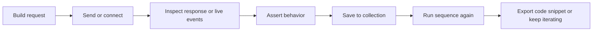

# Nexus

> A local-first desktop API workbench for HTTP, GraphQL, WebSockets, mock servers, assertions, and collection runs.

Nexus is built for developers who want more than a request tab and a response pane. It gives you one desktop workspace for exploring APIs, validating behavior, replaying flows, mocking endpoints, and turning successful experiments into repeatable workflows.


## At A Glance

| Category        | Current state                                                                                                            |
| --------------- | ------------------------------------------------------------------------------------------------------------------------ |
| Best for        | API developers who want one local workspace for request building, protocol testing, assertions, and collection execution |
| Core protocols  | HTTP, GraphQL, WebSocket, local mock server workflows                                                                    |
| Built with      | Electron, Vue 3, TypeScript, Monaco, SQLite                                                                              |
| Verification    | Typecheck, 124 automated tests, Electron smoke coverage, package flow, macOS dry-run release path                        |
| Release posture | macOS-first release path validated locally; Apple signing/notarization intentionally deferred                            |

## Why Nexus Feels Different

Most API clients are optimized for sending one request at a time. Nexus is optimized for what usually happens next.

When you are iterating on an API, you often need to do more than fire a request and inspect a JSON body. You may want to:

- flip between HTTP and WebSocket workflows without changing tools
- run a mock endpoint locally while you shape payloads and assertions
- save requests into collections and execute them in order
- keep a persistent local workspace instead of disposable tabs
- turn a successful request into cURL, `fetch`, or Axios output immediately

That is the layer Nexus is trying to own.

## The Experience In One Flow



## What You Can Do Today

| Workflow             | What Nexus gives you                                                                                                                              |
| -------------------- | ------------------------------------------------------------------------------------------------------------------------------------------------- |
| HTTP requests        | Full request building for `GET`, `POST`, `PUT`, `PATCH`, `DELETE`, `HEAD`, and `OPTIONS`, with headers, params, auth, and structured body editing |
| GraphQL              | Query editing, variables, operation names, and proper request payload generation                                                                  |
| WebSocket testing    | Connect, disconnect, send messages, and inspect a live event timeline                                                                             |
| Local mocking        | Define routes, run a localhost mock server, and review captured mock traffic                                                                      |
| Validation           | Add assertions for status, headers, and body content                                                                                              |
| Request reuse        | Save requests into hierarchical collections and replay them later                                                                                 |
| Collection execution | Run request groups sequentially with stop-on-failure behavior and basic `last_*` chaining                                                         |
| Code generation      | Export the active request as cURL, `fetch`, or Axios                                                                                              |
| Environments         | Use `{{variable}}` substitution with secret-aware environment values                                                                              |
| Discovery            | Probe common OpenAPI and Swagger spec locations and import discovered endpoints                                                                   |
| History              | Track and replay prior requests from local history                                                                                                |

## Current Stage

Nexus has moved well beyond an early prototype. The app now has:

- working desktop flows for HTTP, GraphQL, WebSocket, mock server, assertions, and collection runner behavior
- local persistence through SQLite for workspaces, collections, requests, environments, and history
- runtime-hardened IPC boundaries and tighter Electron trust controls around the app surface
- automated verification across typecheck, unit/component coverage, Electron smoke coverage, packaging, and release dry-runs
- a macOS-first release path with manifest, checksum, and go/no-go evidence generation

Current release reality:

- local use and dry-run release readiness are strong
- Apple signing and notarization are still intentionally deferred for later credential setup
- team collaboration and cloud sync remain intentionally out of scope for the current release target

## Who Should Try It

Nexus is a strong fit if you want:

- a desktop API client that feels like a workbench instead of a scratchpad
- one tool for HTTP plus adjacent API workflows
- a local-first setup with no cloud account required
- persistent request organization instead of disposable tab chaos
- built-in validation and runner behavior before you reach for custom scripts
- a modern Electron/Vue codebase that is already meaningfully exercised and verified

## Quick Start

### Prerequisites

- Node.js 18+
- `pnpm`
- Git

### Install and run

```bash
git clone https://github.com/saagar210/Nexus.git
cd Nexus
pnpm install
pnpm start
```

### Useful commands

```bash
# Standard development mode
pnpm start

# Low-disk development mode with ephemeral Vite cache
pnpm lean:start

# Type safety
pnpm typecheck

# Unit and component tests
pnpm test

# Electron desktop smoke test
pnpm test:e2e:smoke

# Package the app locally
pnpm package

# Full macOS release dry-run without signing/notarization
pnpm release:mac:dry-run
```

## Verification Snapshot

Current verification coverage includes:

- `pnpm typecheck`
- `pnpm test`
- `pnpm test:e2e:smoke`
- `bash .codex/scripts/run_verify_commands.sh`
- `pnpm package`
- `pnpm release:mac:dry-run`

Recent local evidence from the implementation pass:

- 124 automated tests passing
- Electron desktop smoke path passing
- package flow passing
- macOS dry-run release path producing manifest, checksums, and go/no-go evidence

## Security And Architecture Notes

Nexus uses a typed IPC contract between the Electron renderer and main process, and that boundary is not trusted by default.

Current protections include:

- runtime IPC payload validation for privileged main-process handlers
- preload event subscription allowlisting
- trusted renderer origin checks
- navigation and popup denial outside the intended app surface
- renderer sandbox enablement and tighter Electron surface controls

Local secrets are resolved in the main process so sensitive environment values do not need to live directly inside renderer-side UI logic.

## Stack

- Electron 40
- Vue 3
- TypeScript
- Pinia
- Tailwind CSS 4
- Monaco Editor
- SQLite via `better-sqlite3`
- `undici` for HTTP execution
- `ws` for WebSocket workflows
- Vitest + Vue Test Utils + Playwright Electron smoke coverage
- Electron Forge + Vite

## Project Layout

```text
Nexus/
├── electron/                  # Main process, preload bridge, and desktop services
├── src/                       # Vue renderer, stores, and UI
├── shared/                    # Shared IPC contracts and types
├── tests/                     # Unit, component, shared, and Electron smoke coverage
├── docs/                      # Execution and release notes
└── scripts/                   # Build, release, perf, and repo guardrail scripts
```

## Roadmap From Here

The biggest remaining release step is operational rather than product-functional:

- Apple signing and notarization setup for a fully production-ready macOS release

Explicitly deferred for now:

- team collaboration features
- cloud sync and shared remote workspaces

## Contributing

If you want to explore the project locally, the best path is:

1. install dependencies with `pnpm install`
2. run the app with `pnpm start`
3. validate changes with `bash .codex/scripts/run_verify_commands.sh`

The repository also includes branch, commit, secret-scan, and performance guardrails to keep changes disciplined as the app moves toward a fuller release.

## License

MIT
